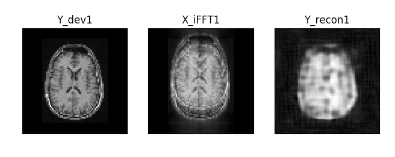
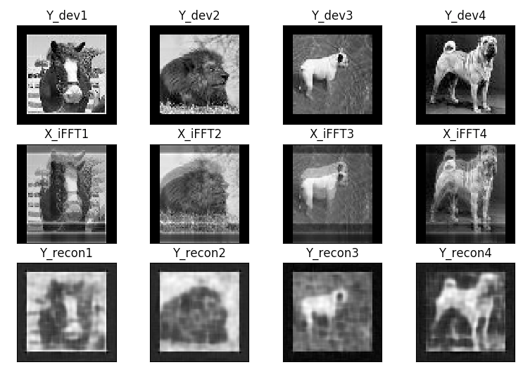

This is my implementation of the AUTOMAP algorithm described in the following paper:
B. Zhu, J. Z. Liu, B. R. Rosen, and M. S. Rosen. Image reconstruction by domain transform manifold learning. arXiv preprint arXiv:1704.08841, 2017.
https://arxiv.org/abs/1704.08841

NB1: I run the code at AWS cluster, using the following AMI: Ubuntu x64 AMI with TensorFlow (GPU) (https://goo.gl/F3zPNv), and the following instance: g2.2xlarge. 
NB2: I use the following Python package to download images from ImageNet: imagenetscraper 1.0 (https://goo.gl/QK6f8p)

I encourage you to contact me if you have any questions, comments, or suggestions: tetiana.d@gmail.com.

The code uses data in image space and corresponding frequency space to teach a CNN model to do a reconstruction of an MRI image. The architecture consists of fully-connected (FC) and convolutional (Conv) layers and is the following:
FC1 -> tahn activation -> FC2 -> tanh activation -> Conv1 -> ReLU activation -> Conv2 -> ReLU activation -> de-Conv

generate_input.py  
This includes function load_images_from_folder, which creates training set for a model. It loads images into array Y and performs a Fourier transform and saves both real and imaginary parts of it into array X.
Optional normalizing of data and rotation of input images are available.

generate_input_motion.py  
This includes function load_images_from_folder, which creates training set for a model. It loads images into array Y and "moves" it by 8 pixels the performs a Fourier transform and combined the frequency space of both Y images (before and after it was moved) - as if the patient moved by 8 pixels in one direction in the middle of the acquisition. Then the function saves both real and imaginary parts of motion-corrupted frequency space into array X.
Optional normalizing of data and rotation of input images are available.

myAutomap.py  
This includes the CNN model using TensorFlow.

myAutomap_recon.py  
Uses forward propagation to reconstruct image from frequency space using the trained model, which was saved in myAutomap.py

(Very) preliminary results:  
First row shows original images; second row shows the images reconstructed from frequency space corrupted by motion - ghosting artefacts are clearly seen; third row shows images reconstructed using trained model - ghosting is gone!, however, images look very blurry - the cost was still quite high, maybe increasing number of epochs will help.

Hyperparameters: learning rate - 0.00002, 7500 images (30000 after augmentation), 80x80 resolution, 200 epochs.

Example with brain image:  

Other examples:  

